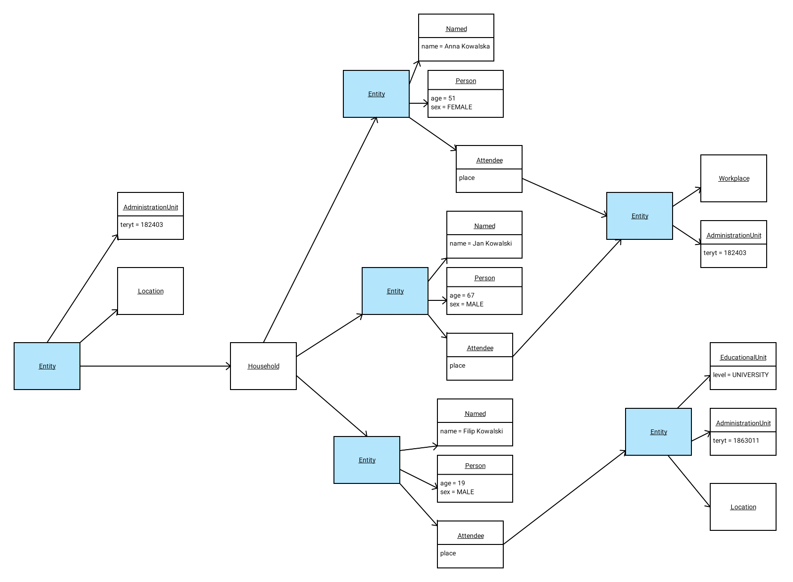

# pdyn1.5 v1.0

The _pdyn1.5 v1.0_ version of the data model consists of 8 components:

There is also a couple of components used for export
(they use the `Exported` prefix)

## Components

### Person
Basic biological data about a single human; currently `sex` and `age`.

### Attendee

An entity that spends most of the out-of-home activities (a "working day")
at one, singled out place. This might be a school (for the youngest) or work.

This component only has one attribute: `place`, which points to the entity
representing (hopefuly) a place, like work or school.

### Named

An entity has a descripting string identifying not the "kind" but the "instance".
For a school, this might be "SP 122 im. Hanki Sawickiej". For a human, it could 
be "Filip Dreger". The only attribute is `name`.

### Household

It's the main living space of an agent, possibly shared by many agent (1-10 is typical). Agents
in a single household are assumed to strongly interact with one another (e.g. share meals, use
the same bathroom, talk). "Household" are meant to model things like:

- flat with a family living together,
- single cell in a monastery
- a room in a DPS
 
shared by 1 or multiple, strongly interacting agents. It is assumed
(but not enforced) that each agent belongs to exactly one household.

### Location

It's a geographical point, described as a pair of northing and easting in the EPSG2180 projection
(aka PL1992). The values are easy to work with, because we can assume they are just x and y in 2D carthesian space,
in meters.

### Administration Unit

Describes things which belong to an administrational unit (like gmina or powiat, or województwo)
and therefore can be assigned a `teryt` number.

### EducationalInstitution

Represents a university, college, kindergarten, nursery - or any other type of institution where
people spend time gaining knowledge or being cared for. The `level` describes the type of place, `pupilCount`
and `teacherCount` represent our "real world" knowledge about the size, but do not necessarily
reflect the number of attendees (workers or pupils). The levels are:

- K - KINDERGARTEN - przedszkole
- P - PRIMARY SCHOOL - podstawówka,
- H - HIGH SCHOOL - szkoła średnia / zawodowa,
- PH - PRIMARY AND HIGH SCHOOL - zespół szkół, zawierający szkołę średnią i podstawową,
- BU - BIG UNIVERSITY - duży uniwersytet,
- U - UNIVERSITY - mniejsza szkoła wyższa.

### Workplace

Place where people work (full-time, we assume). Contrary to the `Household`, it does not represent
a single room within a larger company, but rather a single location (address point) where people
work. Due to existence of factories, mines etc., a workplace can have as much as 1000 workers assigned.

`employees` is a number describing the size of the workplace, but not necessarily the number of agents
currently assigned to the workplace.
 
## Prototypes / kinds

Components can be mixed and matched, but some combinations are "assumed" or "typical".

### Person Entity

- `Person` (e.g. MALE, 67),
- `Named` (e.g. "Zdzisław Trościanko"),
- `Attendee` (e.g. entity representing Zdzisław's workplace)

### Household Entity

- `Household` (list of agents sharing the household)
- `AdministrationUnit` (rough location)
- `Location` (exact location)

### Workplace Entity

- `Workplace` (number of slots for employees)
- `AdministrationUnit` (rough location; workplaces are not, for now, "exactly" located)

### Educational Institution Entity

- `EducationalInstitution`
- `AdministrationUnit`
- `Location`

## Example structure

The structure below (some attribute values omitted for brevity) represents a typical 
household with three members: two elder ones work at the same place (a family business, perhaps?);
the youngest one is a student in Rzeszów, but lives with (presumably) his parents (or he wouldn't
be included in the household).

