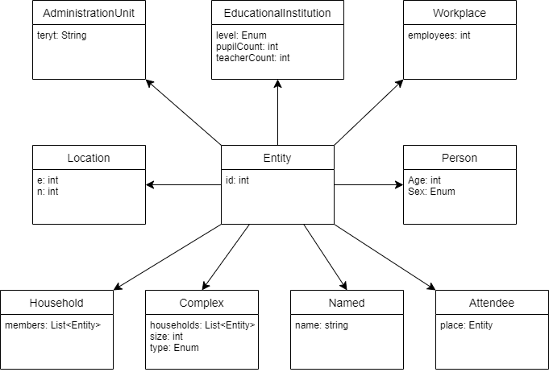
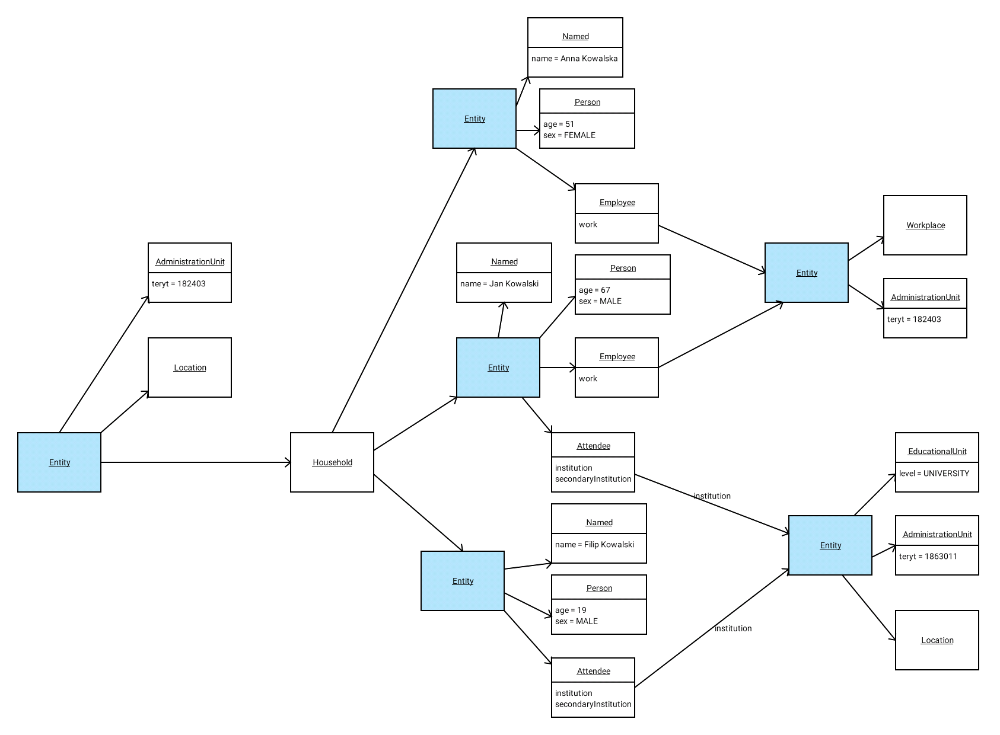

# pdyn1.5 v1.2_SNAPSHOT

The _pdyn1.5 v1.2 SNAPSHOT_ version of the engineIo data model consists of 11 components:

## Components

### Person
Basic biological data about a single human; currently `sex` and `age`.

### Attendee

An entity that attends one or two educational institution. It has two attributes:

- `institution` is an Entity that is an EducationalInstitution: a kindergarden, primary school, highschool or a big university
- `secondaryInstitution` should only be a small university.

This means that while kindergardens, high schools, big universitites
and primary schools are exclusive (i.e. an agent cannot attend a high school and a big university at once),
any of them can be combined with a small university. This constraint is assumed
but not strictly enforced in code.

The shape of the `Attendee` component mirrors design of the original PDYN
and is essential to create a social structure that is mappable to pdyn 1.5
data format. There's work ongoing to redesign and refine this aspect of the mdoel.

### Employee

Entity is employed at a certain `Workplace`. The model only supports a single, full-time employment.

- `work` is an Entity, presumably with a `Workplace` component.

### Named

An entity has a descriptive string identifying not its "kind" but the "instance".
For a school, this might be "SP 122 im. Hanki Sawickiej". For a human, it could 
be "Filip Dreger". The only attribute is `name`.

### Household

It's the main living space of an agent, possibly shared by many agent (1-10 is typical). Agents
in a single household are assumed to strongly interact with one another (e.g. share meals, use
the same bathroom, talk). "Household" are meant to model things like:

- flat with a family living together,
- single cell in a monastery
- a room in a DPS
 
shared by 1 or multiple, strongly interacting agents. It is assumed
(but not enforced) that each agent belongs to exactly one household.

### Location

It's a geographical point, described as a pair of northing and easting according to EPSG2180 projection
(aka PL1992). The values are easy to work with, because we can assume they are just x and y in 2D carthesian space,
expressed in meters.

### Administration Unit

Describes things which belong to an administrational unit (like gmina or powiat, or województwo)
and therefore can be assigned a `teryt` number.

The precision of `teryt` is not given (it can be just two digits, or five, or seven)

### EducationalInstitution

Represents a university, college, kindergarten, nursery - or any other type of institution where
people spend time gaining knowledge or being cared for. The `level` describes the type of place, `pupilCount`
and `teacherCount` represent our "real world" knowledge about the size, but do not necessarily
reflect the number of attendees (workers or pupils). The levels are:

- K - KINDERGARTEN
- P - PRIMARY SCHOOL,
- H - HIGH SCHOOL,
- PH - PRIMARY AND HIGH SCHOOL - a polish "zespół szkół", an institution consisting of both a high school and a primary school,
- BU - BIG UNIVERSITY - duży uniwersytet,
- U - UNIVERSITY - mniejsza szkoła wyższa.

### Workplace

Place where people work full-time. Contrary to the `Household`, it does not represent
a single room within a larger company, but rather a single location (address point) where people
work. Due to existence of factories, mines etc., a workplace can have as much as 1000 workers assigned.

`employees` is a number describing the size of the workplace, but not necessarily the number of agents
currently assigned to the workplace.

### Replicant

This entity does not come from our generic model (like the gus model, a workplace distribution etc).
Instead it was fabricated in a separate step, as part of a bigger, meaningful whole - military barracks, a monastery,
dorm, a shelter etc. When such a set of entities is created, it comprises of
both households and their inhabitants - and both types of entities will have a proper `Replicant` component
to mark them as such.

Replicants have a single attribute: `type`, which is an instance of the `ReplicantType` enum.

Current set of replicant types:

- `CLERGY_HOUSE` - a house of the clergy (represented by a single housheold)
- `NURSING_HOME` - a nursing home - emulated by a set of households, each representing a single "room"
- `DORM` - dorm; a set of household of a couple of students each
- `IMMIGRANTS_SPOT` - illegal immigrants (a single household).
- `PRISON` - prison (multiple household represent cells)
- `MONASTERY` - a monastery (multiple housheolds represent cells)
- `BARRACKS` - military installations; multiple households
- `HOMELESS_SPOT` - a single household representing an area like a part of a railway station

A set of households representing a single "location",
like a collection of rooms of a single dorm house, is connected into one `Complex`.

### Complex

Represents a set of connected `households` (e.g. located in one building), which are stored as a list.
Number of people living in one complex is defied by attribute `size`.
There are different types of complexes (parameter `type`), currently used only for Replicants fabrication:

- `CLERGY_HOUSE`
- `NURSING_HOME`
- `DORM`
- `PRISON`
- `MONASTERY`
- `BARRACKS`

For details see `Replicant`.

## Prototypes / kinds

Components can be mixed and matched, but some combinations are "assumed" or "typical".

### Person Entity

- `Person` (e.g. MALE, 67),
- `Named` (e.g. "Zdzisław Trościanko"),
- `Attendee` (e.g. entity representing Zdzisław's workplace)
- `Replicant` (optional)

### Household Entity

- `Household` (list of agents sharing the household)
- `AdministrationUnit` (rough location)
- `Location` (exact location)
- `Replicant` (optional)

### Workplace Entity

- `Workplace` (number of slots for employees)
- `AdministrationUnit` (rough location; workplaces are not, for now, "exactly" located)

### Educational Institution Entity

- `EducationalInstitution`
- `AdministrationUnit`
- `Location`

## Example structure

The structure below (some attribute values omitted for brevity) represents a typical 
household with three members: two elder ones work at the same place (a family business, perhaps?).
the youngest one and the older male are also students in Rzeszów
(this is probably not usual, but legal from the model's perspective).

